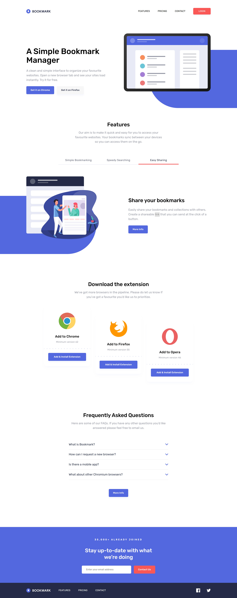

# Frontend Mentor - Bookmark landing page solution

This is a solution to the [Bookmark landing page challenge on Frontend Mentor](https://www.frontendmentor.io/challenges/bookmark-landing-page-5d0b588a9edda32581d29158).

## Overview

### The challenge

Users should be able to:

- View the optimal layout for the site depending on their device's screen size
- See hover states for all interactive elements on the page
- Receive an error message when the newsletter form is submitted if:
  - The input field is empty
  - The email address is not formatted correctly

### Screenshot



### Links

- [Solution URL](https://github.com/MaxCoder-mc/Bookmark-landing-page.git)
- [Live Site URL](https://maxcoder-mc.github.io/Bookmark-landing-page/)

## My process

### Built with

- Semantic HTML5 markup
- ARIA attributes for accessibility
- CSS custom properties for maintainability
- Flexbox and CSS Grid for layout
- Mobile-first responsive design
- Vanilla JavaScript for interactivity and validation

### What I learned

This project reinforced how small accessibility and logic tweaks can make a big difference without changing the visual outcome.

```html
<!-- Accessible FAQ structure -->
<button
  class="faq-question"
  aria-expanded="false"
  aria-controls="answer1"
  id="question1"
>
  <h3>What is Bookmark?</h3>
  
</button>
<div
  id="answer1"
  class="faq-answer"
  role="region"
  aria-labelledby="question1"
  aria-hidden="true"
>
  <p>...</p>
</div>
```

```js
// Improved form validation
ctaForm.addEventListener("submit", (e) => {
  e.preventDefault();
  const email = emailInput.value.trim();
  const valid = /^[^@]+@[^@]+\.[a-z]+$/i.test(email);

  if (!valid) {
    emailInput.classList.add("error");
    errorMsg.textContent = "Whoops, make sure it’s an email";
    emailInput.setAttribute("aria-invalid", "true");
  } else {
    emailInput.classList.remove("error");
    emailInput.removeAttribute("aria-invalid");
    // submit logic...
  }
});
```
